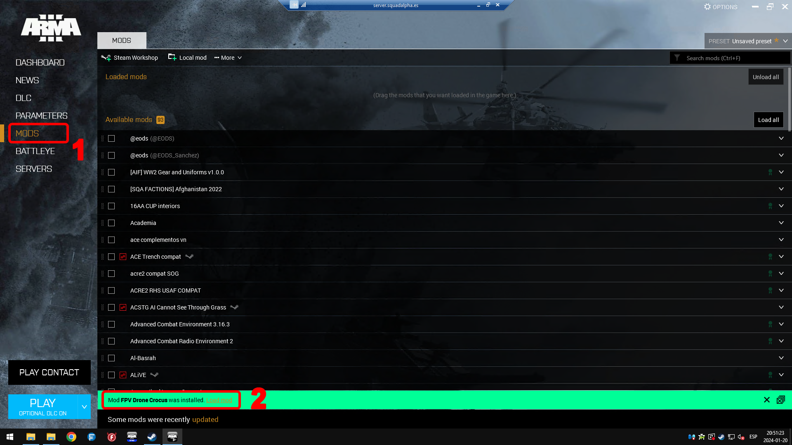
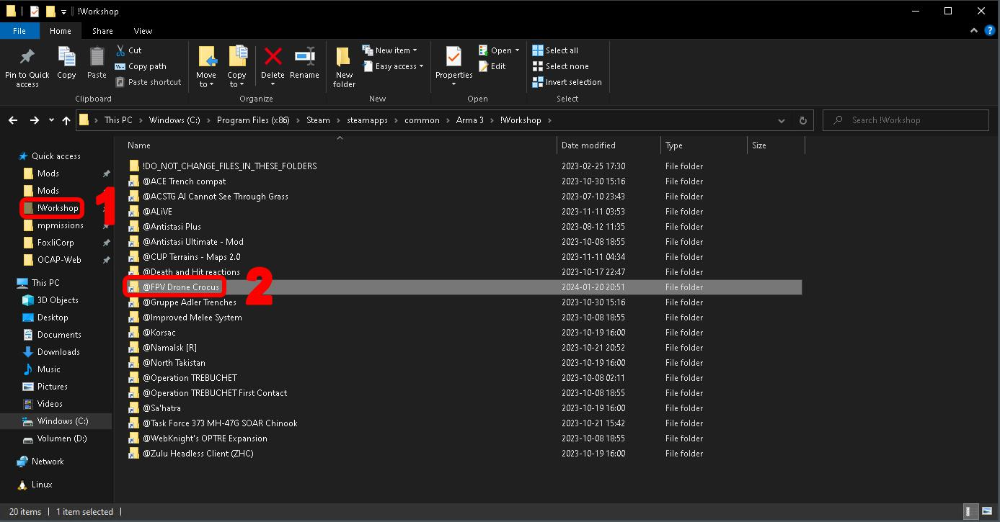
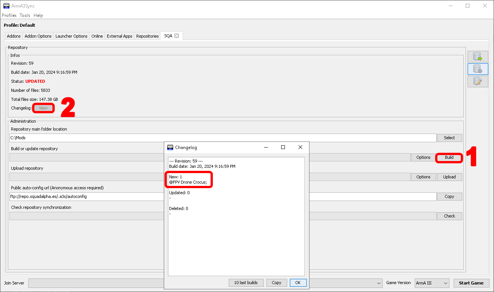
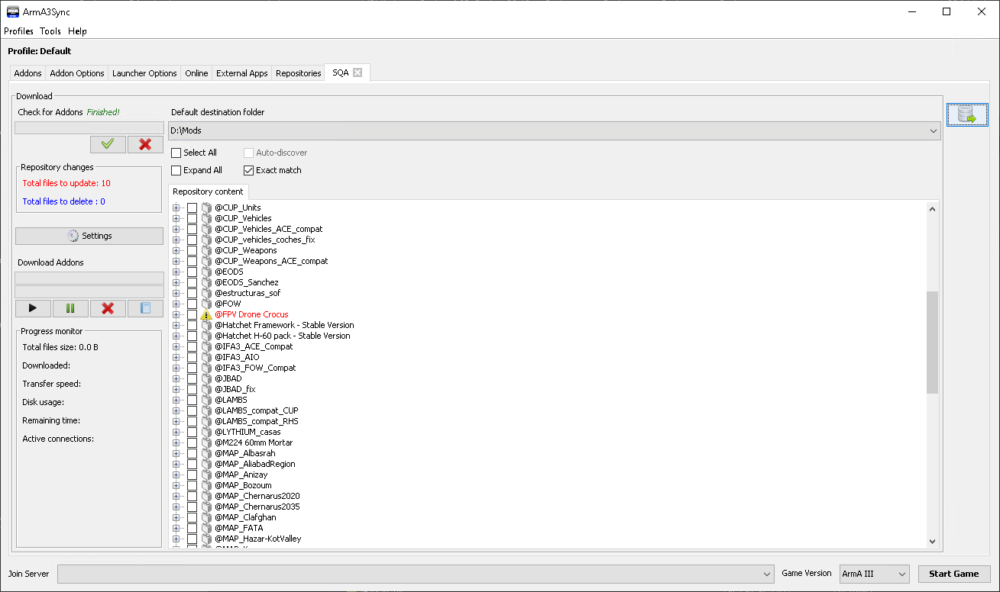
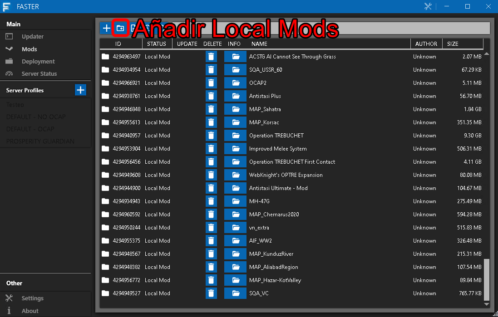

# Actualizar/instalar mod(s)

!!! warning "¡ATENCIÓN!"

    Hacer un backup en caso de actualizar, y que sea descriptivo por favor. En mi caso suelo poner una carpeta en el escritorio llamada Backup día-mes-año NombreMods

!!! warning "¡ATENCIÓN!"

    Si el mod está siendo usado por la academia, pararla. (Y no olvidarse de volverla a arrancar.)

Una tarea común de GOP es actualizar/instalar algún mod.

## Desde workshop

Desde steam nos subscribimos al mod que deseemos actualizar, por ejemplo [este](https://steamcommunity.com/sharedfiles/filedetails/?id=3045129955&searchtext=).

!!! warning "¡ATENCIÓN!"

    Si nos pide subscribirnos a articulos adicionales por norma general NO aceptamos. Es muy posible que ya esté en el repositorio el mod.
    
    En este ejemplo, nos pide el CBA_A3, que ya lo tenemos en el repositorio, por lo tanto rechazamos.

Abrimos el launcher de ARMA 3 desde steam, en el apartado mods nos confirmará que lo tenemos instalado.

<figure markdown>
  
</figure>

La carpeta donde se guardan los mods se encuentra en acceso rápido en el explorador de archivos. Se llama **!Workshop**.

<figure markdown>
  
</figure>

Es buen momento para aprender como está estructurado el server.

* Por una parte, tenemos la ruta C:\Mods, aquí estan todos los mods de donde los miembros/reclutas descargan el **REPOSITORIO** (que al final es un server FTP).
* D:\Mods al contrario, es de donde **EL SERVIDOR ARRANCA LAS PARTIDAS**. Es una copia 1:1 de C:\Mods.

Resumiendo.

1. De la carpeta !Workshop nos vamos a C:\Mods y pegamos el mod ahí. 
2. Hacemos una actualización de repo (explicada en la siguiente sección)
3. Desde el propio Arma3Sync descargamos el repo al server (es decir, que el propio A3Sync copia de C:\Mods a D:\Mods).

### Actualizar el repositorio de Arma3Sync

!!! warning "¡PELIGRO!"

    Es muy importante **PARAR LA ACADEMIA**, sobretodo si actualizamos MODS en uso, referenciar la seccion de SERVICIOS.

Siguiendo el ejemplo anterior, se ha copiado el fichero @FPV Drone Crocus a C:\Mods. Abrimos A3Sync y clicamos en Repositories y nos vamos a las opciones del repositorio SQA, el principal.

1. Darle a BUILD
2. Opcionalmente ver el changelog.

<figure markdown>
  
</figure>

Por último desde el **SERVIDOR** nos descargamos el repositorio, como si fuésemos miembros/reclutas.

<figure markdown>
  
</figure>

Para terminar nos **DESUBSCRIBIMOS** de la workshop del MOD y arrancamos el launcher.

## Desde Github/Externo

Algunos mods ([ACE3](https://github.com/acemod/ACE3), [KAT](https://github.com/KAT-Advanced-Medical/KAM)) nos dan la posibilidad de actualizarlos sin necesitar usar Workshop, la principal ventaja es saber la versión que estamos instalando de una manera más fácil, pero no importa mucho.

Hay que seguir los pasos descritos en la sección de Workshop pero obviando !Workshop, etc.

## Pasarlo al FASTER

Cuando tenemos el mod en D:\mods hace falta decirle al FASTER que existe, para ello nos vamos al faster y a la categoría mods y añadimos un mod local.

<figure markdown>

</figure>

Cuando lo tengamos añadido debemos ir a Deployment y deploy all o lo que se necesite.

### Peculiaridades de ACE y otros mods

ACE y algunos mods se pueden dividir en submods. Por ejemplo en @ACE y @ace_complementos. La carpeta @ACE dentro de ella cuenta con la carpeta *optionals*. En ella nos interesan los siguientes mods opcionales.

* @ace_nocrosshair
* @ace_nouniformrestrictions
* @ace_particles
* @ace_realisticdispersion
* @ace_tracers

Nos metemos en la carpeta addons de cada uno de ellos paso por paso y los copiamos en la carpeta @ace_complementos/Addons.

!!! warning "¡ATENCIÓN!"

    Debemos borrar las versiones anteriores.

Pasamos build al repo y actualizamos como se ha descrito en las anteriores secciones.

## Borrar un mod

Borramos la carpeta de las rutas C:\Mods_server y C:\Mods_repo y volvemos a BUILD el repo y descargar el repo.