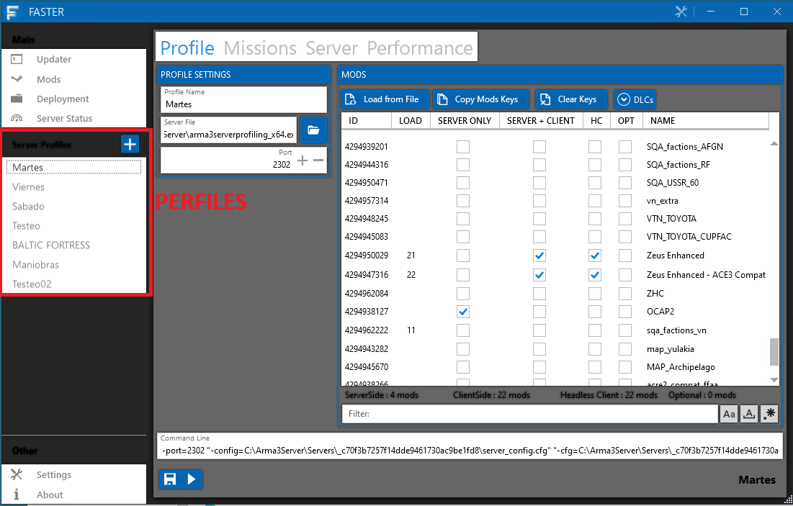
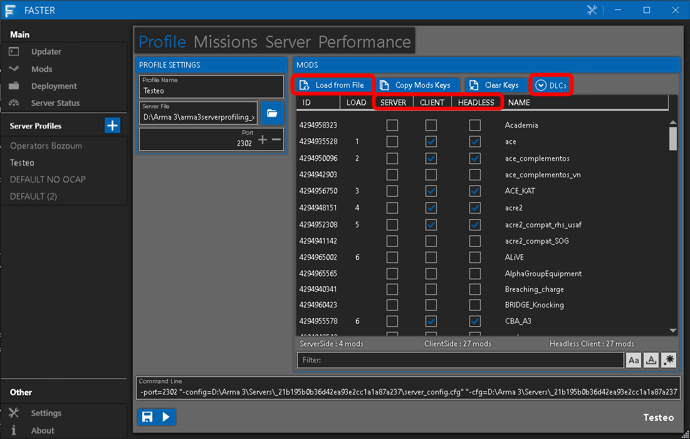
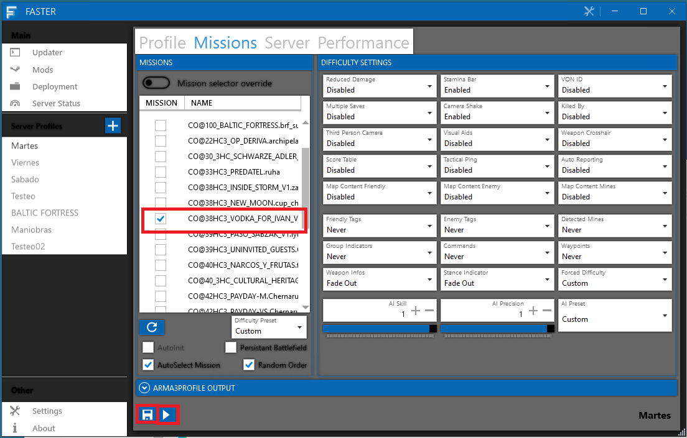
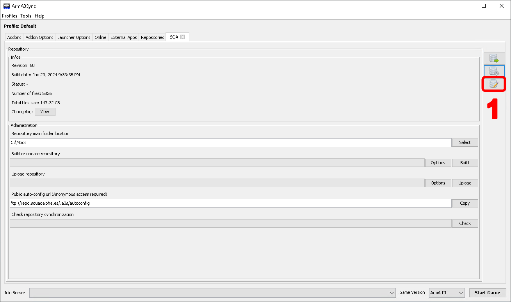
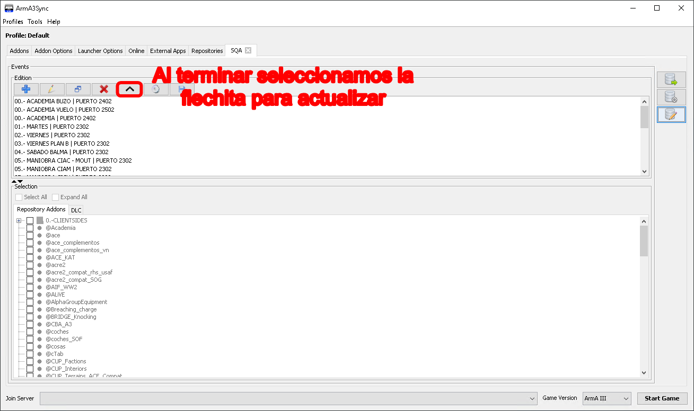

# Arrancar una partida

Para arrancar una partida usamos FASTER.

## FASTER.

Faster es un programa para arrancar servidores de ARMA 3 con una configuración sencilla además de aportar virtualización cuando se arranca el server. Esta documentación no tiene como objetivo conocer todas las posibilidades de FASTER. Para ello referenciar el manual del servidor dedicado de [Arma 3](https://community.bistudio.com/wiki/Arma_3:_Dedicated_Server).

La primera vez que arrancamos FASTER nos aparecerá esta ventana. De aquí lo único que nos interesa es el cuadro de PERFILES.

1. Operators Bozoum / similares: Perfiles para partidas que se juegan constantemente.
2. Testeo: Su propio nombre lo indica, un perfil para el testeo de misiones.
3. DEFAULT NO OCAP: El que usaremos para partidas oficiales sin OCAP.
4. DEFAULT: Lo mismo que el anterior pero con OCAP.

<figure markdown>
  
</figure>

Por ejemplo, vamos a levantar una misión, PREDATEL, queremos testearla. Para ello nos vamos al perfil de Testeo. De aquí nos interesan tres partes, que haremos en orden.

1. Primero haremos click derecho en Server y le daremos a SELECT NONE, haremos lo mismo con client y headless, esto es para borrar todos los mods anteriores.
2. Iremos a DLCs y comprobaremos que no hay ninguno marcado, para una partida de Vietnam seleccionaríamos Prairie Fire.
3. Le damos a Load from file, y elegimos el fichero .HTML de la misión, los editores deben proporcionarnos un archivo .HTML, tampoco está de más (por experiencia) chequear los mods que cargan. En el ejemplo el archivo HTML de PREDATEL.
4. Nos aparecerán los mods en client, damos CLICK DERECHO a HEADLESS y **COPY FROM CLIENT**.

Nos faltan los mods de server, que son los siguientes.

* @SQA (SERVER, CLIENT, HEADLESS TICKADOS)
* LAMBS y sus compats, dependiendo de la misión será RHS o CUP, preguntar al editor si se le ha olvidado. (SERVER, CLIENT, HEADLESS TICKADOS)
* OCAP si el editor lo desea. (SOLO SERVER)

Debemos ticarlos. Con esto tenemos los mods configurados.

<figure markdown>
  
</figure>

Por último debemos elegir la misión, nos vamos a Missions, y ticamos la misión (en mi caso Predatel). Cómo penúltimo paso, **ES MUY IMPORTANTE DARLE A GUARDAR PREVIAMENTE A LANZAR EL SERVIDOR**, lanzamos, y listo.

<figure markdown>
  
</figure>

Para finalizar, debemos estar atentos al arranque del server y tener el juego preparado. El servidor por norma general si pasa bastante rato entre que está arrancado y un usuario entra, la partida carga a mapa directamente. Tenemos que ser rápidos y entrar de admin.

!!! warning "¡PELIGRO!"

    No sueltes el admin hasta que estés dentro de la partida en caso de que el editor te lo pida, o le das zeus aparte.

## Hacer un modset en Arma3Sync

Como parte del proceso de arrancar una partida, hay que hacer un modset para que los miembros/reclutas puedan acceder a la partida con los mismos mods.

Nos vamos al repositorio SQA por ejemplo y clicamos el botón de modificar eventos. 

<figure markdown>
  
</figure>

Seleccionamos el evento, por ejemplo martes, y seleccionamos **A MANO** (lo siento) todos los mods de la partida, a continuación subimos y listo.

<figure markdown>

</figure>

