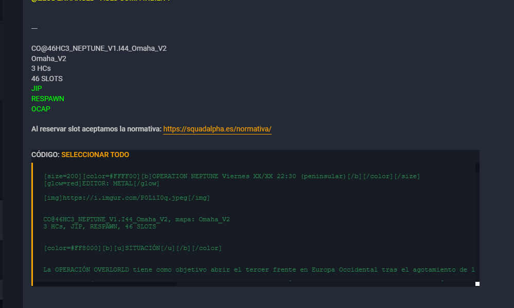
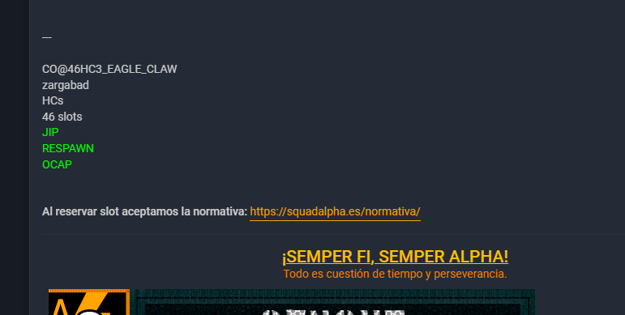

# Publicacion de partidas en el foro

En este apartado se recoge buenas prácticas para el posteo de partidas

## Instrucciones y practicas

Desde el equipo de GIA, a lo largo de la semana, iran creando en el apartado correspondiente del foro [INDIA - Instruccion](https://foro.squadalpha.es/viewforum.php?f=46), todo lo que se hara durante la semana siguiente que realizaremos dentro de la escuadra.

De esta parte unicamente tendremos que informar del dia y el enlace dentro de ```= ALPHA FORCE NETWORK =```

#### Ejemplo de texto para ALPHA FORCE NETWORK de una semana normal
```
Lunes:
Curso Instrucción de Buceador de Combate
https://foro.squadalpha.es/viewtopic.php?t=9296

Martes:
TUTORÍAS
https://foro.squadalpha.es/viewtopic.php?t=9304
VODKA FOR IVAN
https://foro.squadalpha.es/viewtopic.php?t=9308

Miércoles:
CURSO DE EDICIÓN
https://foro.squadalpha.es/viewtopic.php?t=9303

Jueves:
Curso Instrucción de Artillería y Morteros
https://foro.squadalpha.es/viewtopic.php?t=9302

Viernes:
BALTIC FORTRESS
https://foro.squadalpha.es/viewtopic.php?t=9307

Sábado:
Sábado de Prácticas
https://foro.squadalpha.es/viewtopic.php?t=9305
```

## Operativos de la semana

Los operativos de la semana se publican Sabado (despues de partida) o el domingo a media mañana; estos operativos estan marcados en el [Calendario de partidas](https://foro.squadalpha.es/viewtopic.php?t=5390) que nos ofrecen desde el grupo de GET. Una vez que veamos el nombre del operativo en el calendario de partidas, accederemos a [Listado de misiones oficiales](https://foro.squadalpha.es/viewforum.php?f=87) y buscaremos la partida que toca esta semana.

Una vez encontradas las partidas tenemos 2 metodos de publicacion:

### Metodo 1 (codigo al final de publicacion)

<figure markdown>
  
  <figcaption>Post con codigo</figcaption>
</figure>

Para estas partidas es facil, al lado de "CÓDIGO" le damos a seleccionar todo y copiamos todo el texto que nos selecciona. Este codigo deberia ser la misma publicacion que estamos viendo como base.

Unicamente deberemos de pegar todo el texto en una nueva publicacion del foro, en la parte que indicamos arriba de [INDIA - Instruccion](https://foro.squadalpha.es/viewforum.php?f=46) y continuar con el paso comun

### Metodo 2 (sin codigo al final de publicacion)

<figure markdown>
  
  <figcaption>Post sin codigo</figcaption>
</figure>

Para estas partidas tenemos que enfocarlo de otra forma. Para coger el codigo base de la partida, debemos como responder al post principal que creo el editor y copiar todo el codigo que tiene, luego cancelamos la respuesta.

Unicamente deberemos de pegar todo el texto en una nueva publicacion del foro, en la parte que indicamos arriba de [INDIA - Instruccion](https://foro.squadalpha.es/viewforum.php?f=46) y continuar con el paso comun

### Comun para ambos metodos

Una vez tengamos el codigo copiado en el post de las partidas, deberemos de cambiar el titulo a la zona de "Asunto" cambiando los XX/XX de la fecha y poniendo la correspondiente. Esto mismo haremos con la fecha del titulo de la publicacion.

Por otro lado, bajaremos a la zona de "Escuadras" de la publicacion y revisaremos que no haya slots extras para ese dia. En el caso de que estas unidades esten en el post, procederemos a eliminarlas de aqui para que nadie pueda cogerlas.

## Slots extras durante la semana

Si durante la semana algunas de las partidas llegara a llenarse (TODOS los slots han sido codigos). Añadiremos unos slots extras añadiendo estas lineas al final de las escuadras disponibles:

```
[color=#80BFFF][b]RESERVAS[/b][/color] 
[rol]RESERVA (R)-[b][color=#80BFFF][slot][/slot][/color][/b][/rol]
[rol]RESERVA (R)-[b][color=#80BFFF][slot][/slot][/color][/b][/rol]
[rol]RESERVA (R)-[b][color=#80BFFF][slot][/slot][/color][/b][/rol]
[rol]RESERVA (R)-[b][color=#80BFFF][slot][/slot][/color][/b][/rol]
[rol]RESERVA (R)-[b][color=#80BFFF][slot][/slot][/color][/b][/rol]
[rol]RESERVA (R)-[b][color=#80BFFF][slot][/slot][/color][/b][/rol]
[rol]RESERVA (R)-[b][color=#80BFFF][slot][/slot][/color][/b][/rol]
[rol]RESERVA (R)-[b][color=#80BFFF][slot][/slot][/color][/b][/rol]
```

Si al final hubiera suficiente gente disponible para entrar, podriamos añadir la escuadra extra que tuviera la partida. Tambien podria darse el caso que desde GET nos habilitaran una escuadra (lo suele hacer el editor) y tuvieramos que añadirla sin que estuviera publicada en el post base.

Tenemos que tener en cuenta que, los slots deben de ocuparse en orden en el que se hayan ido llenando las plazas de reserva. NADIE puede coger plaza sin tener en cuenta el orden de reserva; esta parte sera revisada por PLANA y GOP, para que se respete el orden.