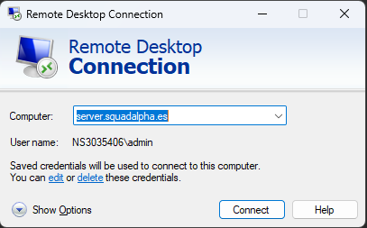

# Acceso al servidor

A fecha del 17/01/2024 el servidor es Windows, para conectarnos se usa el protocolo RDP (remote desktop protocol). Windows ya tiene un cliente para este protocolo, conexión a escritorio remoto.

<figure markdown>
  
  <figcaption>Programa para entrar al server</figcaption>
</figure>

Para conectarnos usaremos las credenciales oportunas.