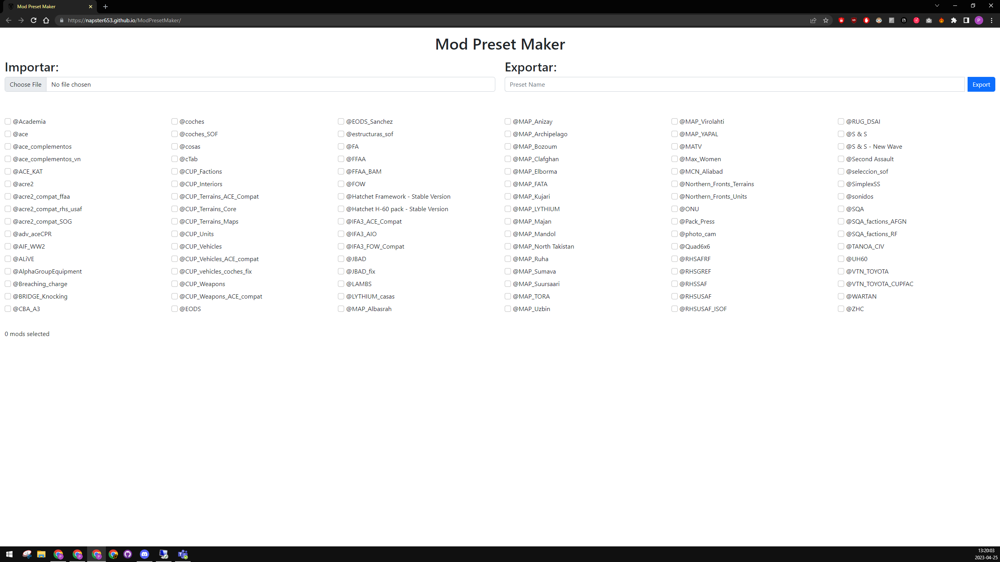

# [Mod Preset Maker (link)](https://napster653.github.io/ModPresetMaker/)

<figure markdown>
  
</figure>

Esta herramienta sirve para crear presets de mods que usa el FASTER para lanzar partidas con esos mods. Es responsabilidad del editor que se genere por primera vez, en caso de que se actualize la partida y el editor esté activo, lo modifique.

Puedes usarla para crear una preset desde cero, o para modificar una preset existente.

Si quieres crear una preset desde cero:

1. Marca las casillas de los mods que necesites.
2. Escribe un nombre en el campo de Exportar.
3. Pulsa el botón Export.

Si quieres modificar una preset:

1. Impórtala buscándola en el menú de Importar.
2. Modifica las casillas.
3. Dale a exportar. El nombre de la preset será el mismo (Seguramente se ponga un (1) al final si la tenías en la carpeta de descargas).