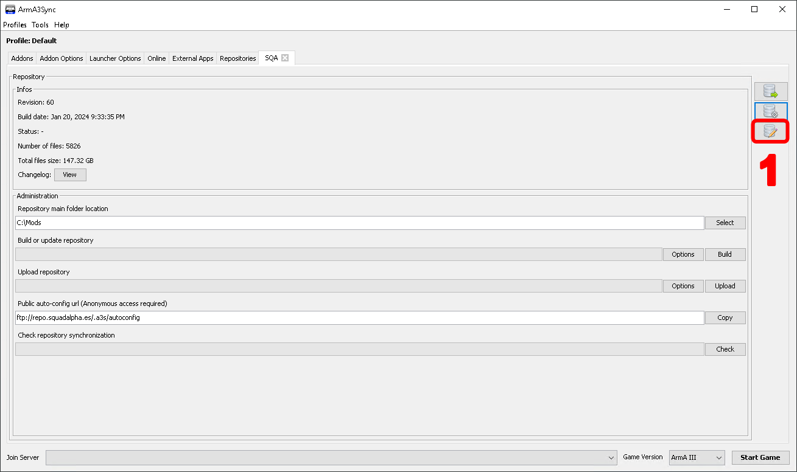
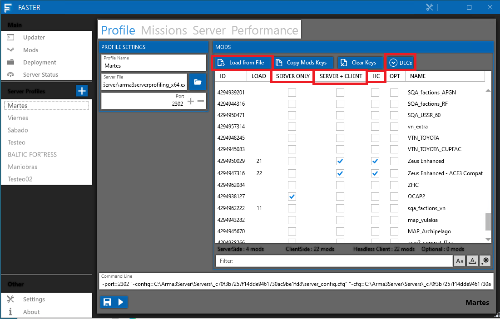
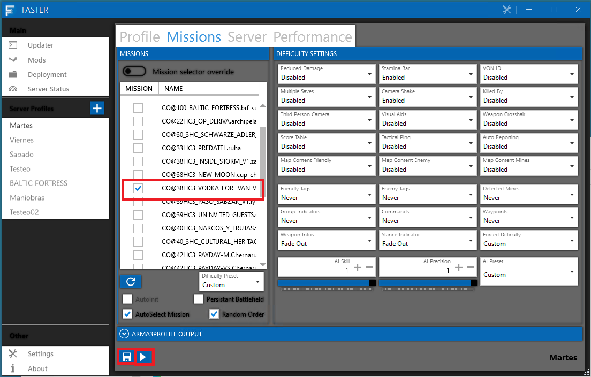

# Gestion de partidas

Vamos a explicar el paso a paso para arrancar una partida

## Configuracion previa

Para que todo fluya algo mejor y podamos prevenir errores, cuando creemos los post del foro, deberiamos de añadir el modset y configurar el faster para que todo este ya configurado el dia de la partida, pero si por alguna casual esto no se hubiera hecho, procederemos a gestionarlo de la siguiente forma:

### Configuracion de modset

Como parte del proceso de arrancar una partida, hay que hacer un modset para que los miembros/reclutas puedan acceder a la partida con los mismos mods.

Nos vamos al repositorio SQA por ejemplo y clicamos el botón de modificar eventos. 

<figure markdown>
  
</figure>

Seleccionamos el evento, por ejemplo martes, y seleccionamos **A MANO** todos los mods de la partida, siempre fijandonos en el HTML que nos facilito el editor, a continuación subimos y listo.

<figure markdown>

</figure>

### Configuracion FASTER

Para tener un poco mas de informacion sobre este programa:

Faster es un programa para arrancar servidores de ARMA 3 con una configuración sencilla además de aportar virtualización (crear instancias aparte) cuando se arranca el server. Esta documentación no tiene como objetivo conocer todas las posibilidades de FASTER. Para ello referenciar el manual del servidor dedicado de [Arma 3](https://community.bistudio.com/wiki/Arma_3:_Dedicated_Server).

La primera vez que arrancamos FASTER nos aparecerá esta ventana. De aquí lo único que nos interesa es el cuadro de PERFILES.

1. Martes / Viernes: Operaciones de martes y viernes que jugaremos durante la semana
2. Testeo: Su propio nombre lo indica, un perfil para el testeo de misiones.
3. Maniobras: Este perfil esta destinado para "partidas" que tienen mas un enfoque de formacion y practica.
4. Baltic Fortress (o similares): Son partidas con persistencia, en las cuales nuestro perfil debe continuar durante toda la persistencia de la partida. Explicaremos mas en [persistencia](persistencia_faster.md)

<figure markdown>
  
</figure>

Seleccionaremos el perfil que queremos cargar y procedemos a configurarlo.

#### Configuracion del perfil

Una vez elegido el perfil que vamos a configurar, seguiremos los siguientes pasos:

<figure markdown>
  
</figure>

1. Primero haremos click derecho en "SERVER ONLY" y le daremos a SELECT NONE, haremos lo mismo con "SERVER + CLIENT" y "HC", esto es para borrar todos los mods anteriores.
2. Iremos a DLCs y comprobaremos que no hay ninguno marcado. Si la partida que vamos a jugar es de Vietnam seleccionaríamos Prairie Fire.
3. Le damos a "Load from file" y elegimos el fichero .HTML de la misión, los editores deben proporcionarnos un archivo .HTML con todos los mods de la partida (son los mismos que hemos cargado en el modset). Esto nos clickara los mods dentro de "SERVER + CLIENT".
4. CLICK DERECHO a "HC" y **COPY FROM CLIENT**. De esta forma copiaremos todos los mods que teniamos en "SERVER + CLIENT" y los tendremos tambien en "HC".

Nos faltan los mods de "SERVER ONLY", que son los siguientes:

* @SQA (SERVER ONLY, SERVER + CLIENT, HC TICKADOS)
* LAMBS y sus compats, dependiendo de la misión será RHS o CUP, preguntar al editor si se le ha olvidado. (SERVER ONLY, SERVER + CLIENT, HC TICKADOS)
* OCAP si el editor lo desea. En partidas de prueba  o testeo no se usa OCAP, al igual que en partidas con persistencia para no desvelar futuras maniobras de la partida (SOLO SERVER ONLY).

Si por alguna casual el html del modset no lo ha generado el editor, podremos hacer los siguientes pasos

##### [Mod Preset Maker (link)](https://napster653.github.io/ModPresetMaker/)

<figure markdown>
  
</figure>

Esta herramienta sirve para crear presets de mods que usa el FASTER para lanzar partidas con esos mods. Es responsabilidad del editor que se genere por primera vez, en caso de que se actualize la partida y el editor esté activo, lo modifique.

Puedes usarla para crear una preset desde cero, o para modificar una preset existente.

Si quieres crear una preset desde cero:

1. Marca las casillas de los mods que necesites.
2. Escribe un nombre en el campo de Exportar.
3. Pulsa el botón Export.

Si quieres modificar una preset:

1. Impórtala buscándola en el menú de Importar.
2. Modifica las casillas.
3. Dale a exportar. El nombre de la preset será el mismo (Seguramente se ponga un (1) al final si la tenías en la carpeta de descargas).


#### Configuracion de mision

Por último debemos elegir la misión. Nos vamos a la pestala de "Missions", y ticamos la misión que vamos a jugar (en este caso VODKA FOR IVAN). Este listado de partidas son los PBOs que encontramos dentro de MPMisions

Cómo penúltimo paso, **ES MUY IMPORTANTE DARLE A GUARDAR PREVIAMENTE A LANZAR EL SERVIDOR**, lanzamos y esperamos que arma arranque el servidor.

<figure markdown>
  
</figure>

#### Arranque del server

Para finalizar, debemos estar atentos al arranque del server y tener el juego preparado. El servidor por norma general si pasa bastante rato entre que está arrancado y un usuario entra, la partida carga a mapa directamente. Tenemos que ser rápidos y entrar de admin.

!!! warning "¡PELIGRO!"

    No sueltes el admin hasta que estés dentro de la partida en caso de que el editor te lo pida, o le promocionas como zeus.


### Parar servicios

Para que no tengamos problemas de *LAG* durante la partida debemos de parar ciertos servicios, de esta forma prevendremos que nos ocasione algunos problemas. (Tienes mas informacion de los servicios [aqui](servicios.md))

<figure markdown>
  
</figure>

5 minutos antes del inicio de la partida (19:55 o 22:25) segun si es martes o viernes, pararemos los servicios de ACADEMIA, y el REPO. En principio con esto daremos por iniciado la partida.

### Terminar una partida

Para que el OCAP se guarde hace falta que salga "Misión Completada" o "Misión Fallida". Ejecutad el script en **GLOBAL EXEC**.

#### Mision completada


```["END1",true,true] call BIS_fnc_endMission;```

#### Misión fallida

```["LOSER",false, true] call BIS_fnc_endMission;```