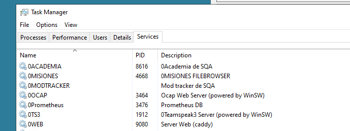
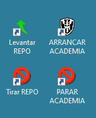

# Servicios (Academia, OCAP, etc)

La academia, el ts, el ocap y otras cosas más el arranque y parada se regulan mediante servicios de windows.

<figure markdown>
  
  <figcaption>Pantalla principal de Servicios de Windows</figcaption>
</figure>

Desde aquí de forma intuitiva podemos parar todos los servicios web que tenemos cargados desde Caddy. Entre ellos tenemos Academia, Misiones (web para subir partidas directamente a la carpeta de Mpmissions), OCAP, graficas o el propio servicio web.

### Archivos .bat para la gestion de servicios

Para facilitar la parada y arranque de los servicios principales que debemos de gestionar en una partida, se han facilitado en el escritorio, los accesos directos a una serie de archivos .BAT que arrancan o parar dichos servicios.

<figure markdown>
  
  <figcaption>Acceso rapido a bat de servicios</figcaption>
</figure>

```
#Ejemplo de codigo de arranque de 0WEB

@echo off
echo Levantando repositorio...
net start 0WEB
echo Repositorio levantado
echo Presione una tecla para cerrar la ventana...
pause >nul
```

# Montar un servicio (créditos: Napster)

**ESTO SÓLO SE PUEDE HACER PARA MISIONES SIN HEADLESS CLIENTS (Academias y maniobras).**

Ahora que tenemos el FASTER limpio y sólo tenemos un perfil DEFAULT y un perfil para cada campaña activa, merece la pena mantener esta limpieza que hace que el FASTER no sea SLOWER.

Para hacer esto, podemos evitar tener perfiles creados para las distintas academias y maniobras llevándonos el perfil al FireDaemon.


En el FASTER:

1. Lo primero que tienes que hacer es crear el perfil en FASTER. Para ello, clona el perfil DEFAULT y ponle el nombre que quieras al nuevo perfil. Lo vas a borrar al final así que el nombre del perfil da igual.

2. En Profile selecciona los mods
3. En Profile escribe el puerto. Normalmente 2302. El 2402 y el 2502 están reservados para la Academia normal y la de vuelo. Cualquier otra academia o maniobra especial se levanta en el 2302.
4. En Missions selecciona la academia.
5. En Server edita el nombre del Hostname. Por lo general usamos el nombre en mayúsculas ("ACADEMIA", "ACADEMIA DE VUELO", "ACADEMIA CIET"...)
6. En Server pon también que tenga 0 HCs. Esto sólo sirve para misiones sin HCs.
7. Lanza el perfil una vez y asegúrate de que te puedes conectar y todo está bien.
8. En la pestana Profile, abajo del todo, copia los contenidos de la caja de texto donde pone Command Line. Puedes seleccionar todo usando Ctrl+A dentro de la caja y copiarlo usando Ctrl+C.
   
En el FireDaemon:

1. Clona un servicio que esté en el 2302. Academia CIET por ejemplo. Para clonar haz click derecho y dale a Clone.
2. Pega la línea que copiaste antes en Parameters.
3. Edita el Short Name del servicio.
4. Edita el Display Name del servicio. Pon algo como [2302] Academia CIET
5. Deja todo lo demás como está y dale a guardar.
6. Lanza el servicio y conéctate para ver que funciona y no la has cagado.

Enhorabuena, has hecho un servicio. Ahora toca la parte de limpiar:

1. Vete al FASTER, en el perfil de la academia que has creado, verás abajo a la derecha el nombre escrito en blanco.
2. Haz click derecho sobre este nombre, y haz click en Open File Location
3. Esto te llevará a una carpeta con un nombre raro compuesto por letras y números, como _f35dc63e775a46e494f38d49a1b90f53.
4. Vete una carpeta arriba y copia la carpeta con el nombre raro.
5. Nombra a la copia con algo como Academia CIET o lo que te salga del pito que sirva para reconocer que en esa carpeta está la config de ese perfil.
6. Ahora vuelve al FireDaemon, y edita el servicio que creaste. En los parameters del servicio, cambia los sitios donde pone el nombre raro por el nombre que has puesto tú a la copia. OJO! Cambia sólo las 3 primeras ocurrencias, las que hacen referencias a la carpeta. La cuarta ocurrencia se refiere al nombre del perfil que usa el server y ese no lo has cambiado, así que deja el nombre raro ahí.
Debería quedarte algo así:

-port=2302
"-config=D:\Arma 3\Servers\_f35dc63e775a46e494f38d49a1b90f53\server_config.cfg"
"-cfg=D:\Arma 3\Servers\_f35dc63e775a46e494f38d49a1b90f53\server_basic.cfg"
"-profiles=D:\Arma 3\Servers\_f35dc63e775a46e494f38d49a1b90f53"
-name=_55f4110ead8f40969c467f86b6f75c70
"-mod=@Academia....

pasa a ser

-port=2302
"-config=D:\Arma 3\Servers\Academia CIET\server_config.cfg"
"-cfg=D:\Arma 3\Servers\Academia CIET\server_basic.cfg"
"-profiles=D:\Arma 3\Servers\Academia CIET"
-name=_55f4110ead8f40969c467f86b6f75c70
"-mod=@Academia...

7. Una vez más, testea lanzando el servicio para ver que te funciona todo.
8. Si ves que funciona todo bien, puedes borrar el perfil del FASTER.

@echo off
echo Levantando repositorio...
net start 0WEB
echo Repositorio levantado
echo Presione una tecla para cerrar la ventana...
pause >nul