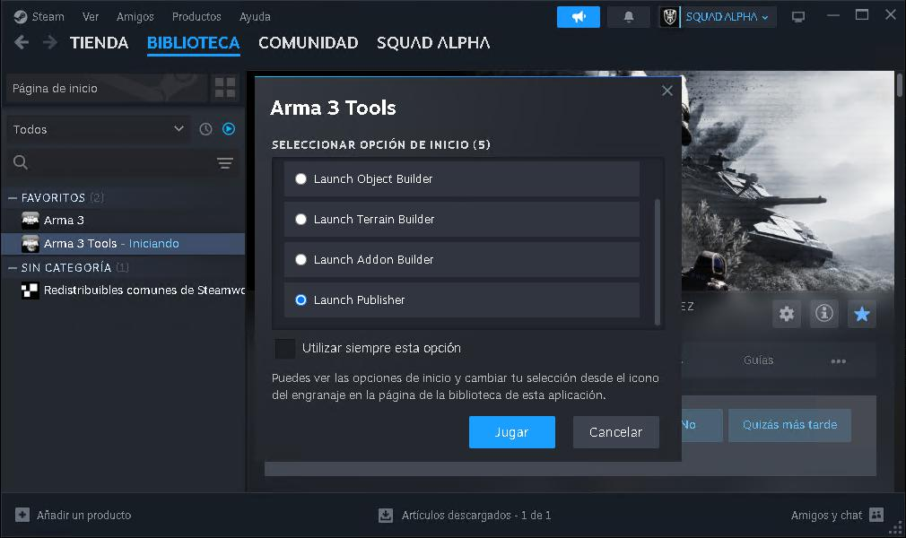
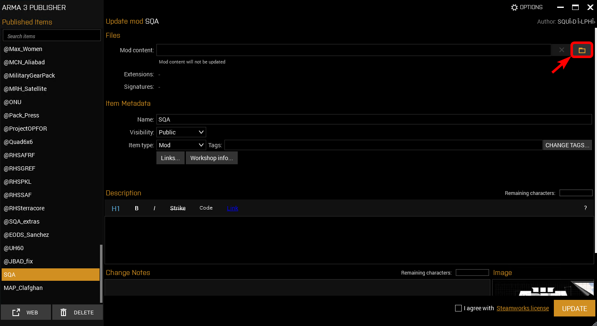
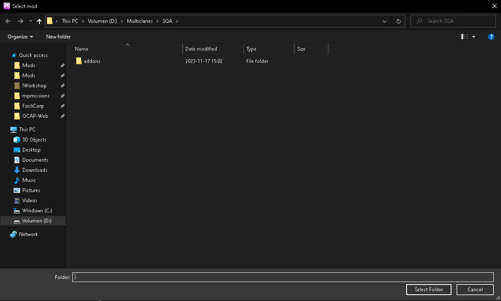

# Actualizar ficheros de workshop

Como posible tarea en caso de jugar multiclanes. Es posible que debamos actualizar algún mod en workshop.

1. Abrimos steam.
2. Arrancamos Arma 3 Tools
3. Seleccionamos el Publisher (la última opción)

<figure markdown>
  
  <figcaption>Seleccionamos publisher.</figcaption>
</figure>

Supongamos que queremos actualizar el mod @SQA.

1. Buscamos en la lista de mods SQA
2. En Mod content vamos a la carpeta raiz del mod

    <figure markdown>
        
        

    <figcaption>Vamos a la carpeta raiz.</figcaption>
    </figure>

3. Actualizamos el mod.

!!! warning "¡PELIGRO!"

    Asegurarse de que el mod no contenga un @ delante del nombre, por ejemplo: @SQA pasa a ser el nombre SQA, Arma 3 se encarga de ponerle el @ (necesario para cargar los mods)